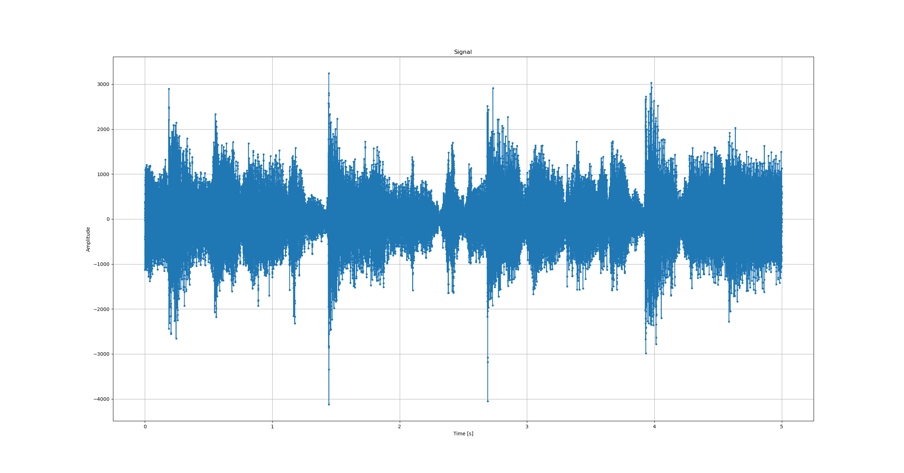
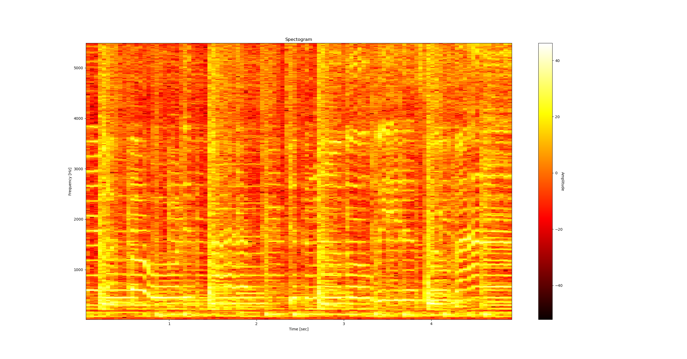
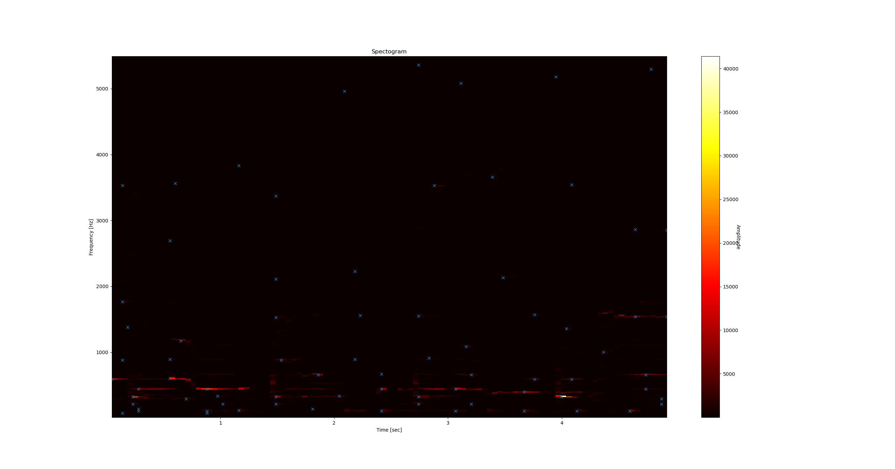
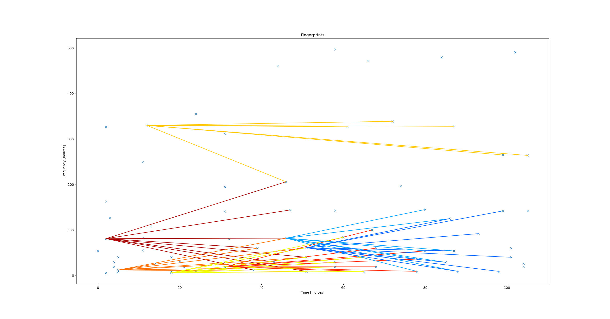
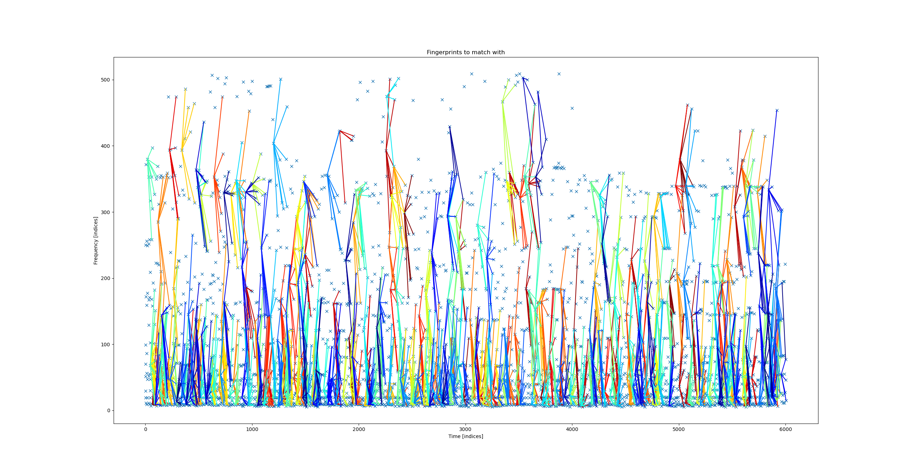
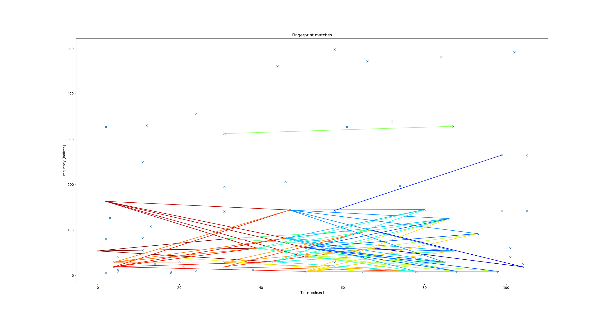
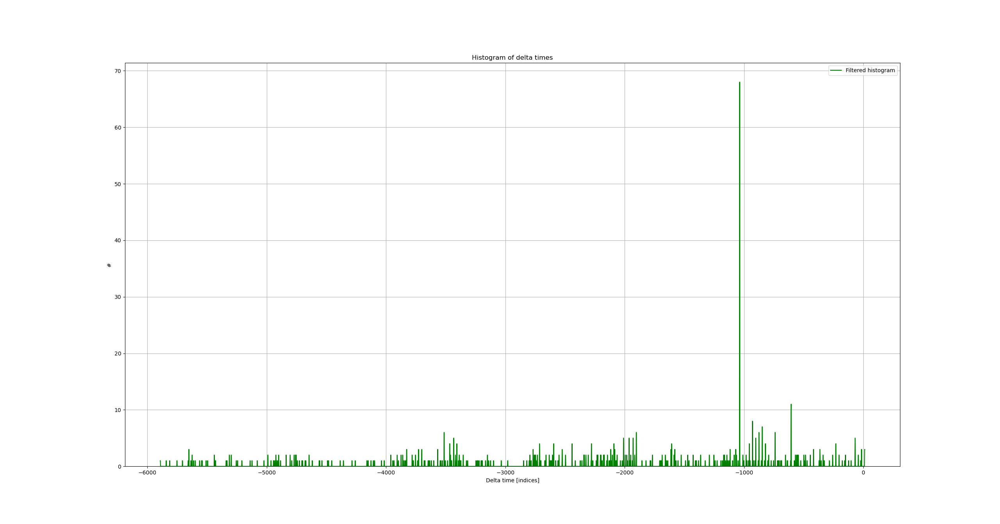
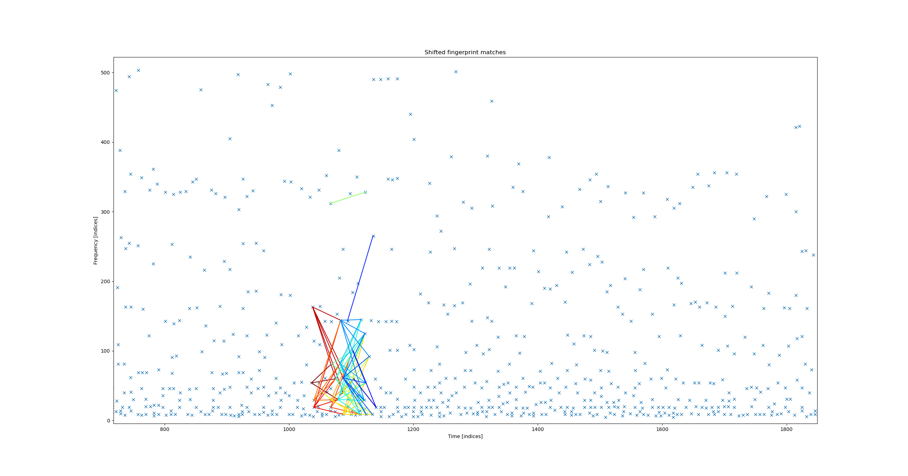

# AudioDetective

An audio identifier application. Identifies e.g. a song by listening to it for a couple of seconds.

# Usage

```
$ python main.py -h
usage: main.py [-h] [-t TIME] [-v] [-x] [-e] [-s] [-l PATH] [-d]

optional arguments:
  -h, --help  show this help message and exit
  -t TIME     record time (default: 5)
  -v          increase output verbosity
  -x          visualize the algorithm
  -e          echo the recorded sound
  -s          list all songs stored in the database
  -l PATH     learn the sounds in a directory
  -d          run a demo of the core digital signal processing part of the
              application
```

Start by setting the database path in config.py. Then run the application with the `-l` argument and a path to a
directory containing songs to add them to the database. Finally run the application again with the `-s` argument to
verify that the songs have been added to the database. Now the application is ready to identify songs!

If the application has problems identifying songs try a longer record time using the `-t` argument. Try also to play
back the recorded audio using the `-e` argument to verified that the recording sounds reasonable.

## Dependencies

* matplotlib
* numpy
* scipy
* sounddevice
* FFmpeg installed and added to path

# Algorithm

This chapter describes the algorithm. It is possible to visualize the algorithm using the `-x` argument when running the
application. Also a demo of the core digital signal processing used can be run using the `-d` argument.

## 1. Pre-processing

This part describes the pre-processing of the audio signal.

### 1a. Decimation

The default sampling rate is set to 44.1 kHz, which means that audios up to 20 kHz can be reconstructed according to the
Nyquist–Shannon sampling theorem. The most important part of audios hearable by humans are in the lower frequency range,
up to around 5 kHz. The signal is therefore downsampled to around 11 kHz using a FIR low pass filter with Hamming window
as anti-alising filter (to remove frequencies above 5 kHz). The Hamming window reduces the ripples of the FIR filter.
The order of the FIR filter controls the width of the transition band (a higher order narrows the transition band but
increases the computation time).

<figure>
    
    <figcaption>An audio signal.</figcaption>
</figure>

## 2. Fingerprint creation

This part describes the steps to create a fingerprint of the audio signal.

### 2a. Spectogram

A spectogram is created from the decimated audio signal using the short-time Fourier transform. Since the Fourier
transform is applied to windowed parts of the audio it will introduce spectral leakage. A Hamming window is used to cope
with the spectral leakage. The window length is a trade-off between time resolution and frequency resolution. A large
window increases frequency resolution but decreases time resolution. Since the signal was decimated in the previous step
it allows for a shorter window with the same frequency resolution. A window size of 1024 gives a spectogram from 0 Hz to
5 kHz (assuming a 11 kHz sampling rate) with frequency resolution around 10 Hz and time resolution around 0.1 seconds.
The windowing of the signal loses data since it is zero at the boundaries. An overlap of the windows is used to cope
with this (a 50 % overlap is optimum for a Hamming window). The last part of the signal is zero padded to keep the same
frequency and time resolution.

Since the signal is real valued only half of the result from the Fourier transform is used (the second half has exactly
the same values as the first part). The values of the first part should be doubled since half of the energy is located
in the second part of the result (except for the DC and Nyqvist values). The result is also scaled to compensate for the
effects of the window. Do however note that the doubling and scaling of the values are not needed for this particular
algorithm. The Fourier transform computation is speed up using the fast Fourier transform algorithm.

<figure>
    
    <figcaption>A spectogram.</figcaption>
</figure>

### 2b. Features

Feature points are extracted from the spectogram by finding peaks using non-maximum suppression. Since the interesting
information decreases as frequencies increases the non-maximum suppression uses a logarithmic window on the frequency
axis. Weak peaks are then removed using a percentile of a large neighborhood of the peak as threshold. Only the time
and frequency is used for the points, the amplitude is ignored.

<figure>
    
    <figcaption>Spectogram features, each x represents a feature point.</figcaption>
</figure>

### 2c. Fingerprint

A fingerprint of the audio is created by pairing feature points. Anchor points are selected and paired with points
inside a target zone limited in time and frequency. It is important to use a target zones to be able to reconstruct the
fingerprint. Using e.g. the x first points after the anchor will make it difficult to reconstruct fingerprints in the
presence of much noise or absent of frequencies (e.g. sound played by a mobile phone speaker). An address is generated
for each point pair consisting of the frequency of the points and the time difference. The absolute time of the anchor
point is kept but not as part of the address.

<figure>
    
    <figcaption>Fingerprints for a short recording.</figcaption>
</figure>

<figure>
    
    <figcaption>Fingerprints for a full song.</figcaption>
</figure>


## 3. Matching

This part describes the matching part of the algorithm.

### 3a. Candidate extraction

The addresses of the fingerprints are used to quickly find matching audios in a database of pre-computed fingerprints.
Only songs with a sufficient number of matching fingerprints are used for further consideration.

<figure>
    
    <figcaption>The matched fingerprints of the short recording above.</figcaption>
</figure>

### 3b. Time coherence verification

Next the time coherency is verified for each candidate by creating a histogram of time offsets between the fingerprints
of the recorded audio and the database candidate. A large peak in the histogram indicates great time coherency. The
candidate with the largest amount of time coherent fingerprints is selected as the matching audio.

<figure>
    
    <figcaption>Histogram of fingerprint time differences between the recording and the full song.</figcaption>
</figure>

<figure>
    
    <figcaption>Matched fingerprints for the full song.</figcaption>
</figure>
